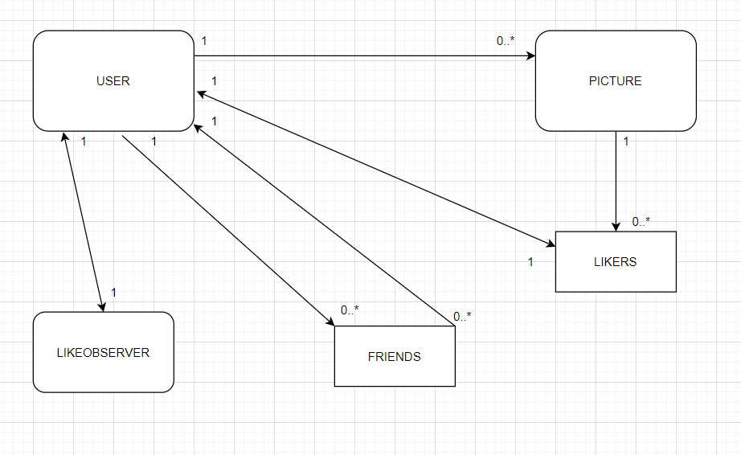
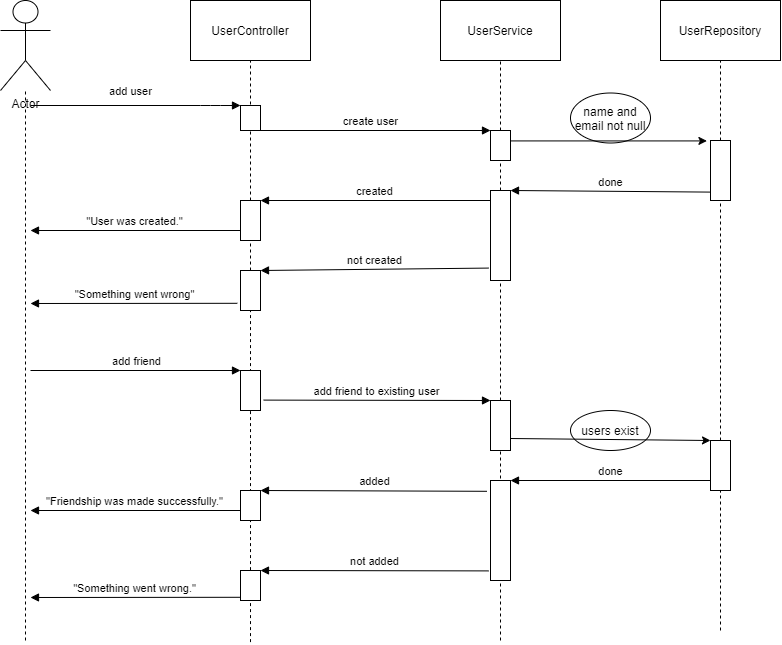

# web app

## ProBook : where professionals meet

This repo contains a web app named Probook, because it's inspired from social-media apps (especially FaceBook), but it doesn't have all the services. "Pro" comes from the fact that professionals can meet here and by professionals I mean those people who have 3 kinds of profession: Engineer, Medic & Teacher. I arrived to this concept thinking about the most important professions of our world. Those who invent and solve problem are engineers. Those who heal people are medics. Those who help people (children/youngsters) to grow in knowledge are teachers.

So there are 3 kinds of user, determined by their profession. Each user can add another user as friend. Also, they can add pictures and like other pictures. If a user has a picture liked by someone else then that user will be notified.

Design patterns:  
* factory is used to make 3 kinds of user for the app.
* observer is used when a user likes another's user photo.
* facade is used for tests.

### implementation

This app was made with the SpringBoot API and it basically persists data with Hibernate API. These data will be used for login of users.
The User Interface is made with JavaScript React API. I have implemented the login and signup of a user. If the user is logged in then he/she can add a picture on his/her account or see other users. The current user can add friends the user that he wants. If two users are friend then they can like each others photos.  
I made some get/post requests in the controllers that receive the parameters in their body (because it's safer to do so). After the parameters are received (for post methods), the services are called and after that depending on the request the repository classes will deal with the request. The services are used for checking and exception handleing and the repository classes acces the database using Hibernate.  
I made two main classes that describe the user and the picture. I also made a class for the LikeObserver which updates a string notification for the user if another user likes a picture of the first one. Also, I made some wrappers for the request-body parameters. These wrappers are made only of the fields needed for the requests.    

### diagram of domain model  

This diagram describes the relations between the main classes of this application. A user can have zero or any number of pictures, hence there's a one-to-many relationship and also a picture has a owner so the relation is bilateral. A user can have zero or any number of friends and some friends can have the same user as their friend. Since a friend is basically another user, we have here a many-to-many relation for the same class (recursion). A user must have a LikeObserver which sees if the user has a picture liked by another user. Then the LikeObserver creates a notification for the user (this will hang somewhere on the web page). Also, a picture must keep track of the users that liked it so this way, a user cannot like a picture multiple times. Hence, a picture has a list of users who liked that picture.   

### observer pattern

When a user likes another's user picture, the second user will have a new notification from the LikeObserver. This notification is made in the moment when the picture gets liked for the first time (and the only one). Basically, each user has a string for notifications. In the beggining this string is empty and when the moment comes the string takes a form of notification says to the current user that he/she has a new like from another user. Each user has it's own LikeObserver so the surveillance doesn't get messed up, because a LikeObserver deals with only one user.  

### factory pattern

The factory pattern is used to created a user in a specific manner, hence by a type. I thought that grouping users by their job is a good ideea so I thought that the most important jobs (especially nowadays) are these: engineers, medics and teachers. The way the factory choses to create an user or another is by a string. This string specifies which type of user we want to have. For the moment the 3 subclasses of user don't have a special attribute.  

### sequence diagram  
This sequence diagram describes two flows: the flow of creating a user and the flow of adding a friend (user) to an existing user.  

### conclusions  
In conclusion, this app can be developed much more in order to resemble more with the existing social-media apps and be capable of handling many users. Till now this app represents just the beginning of a social-media app.
